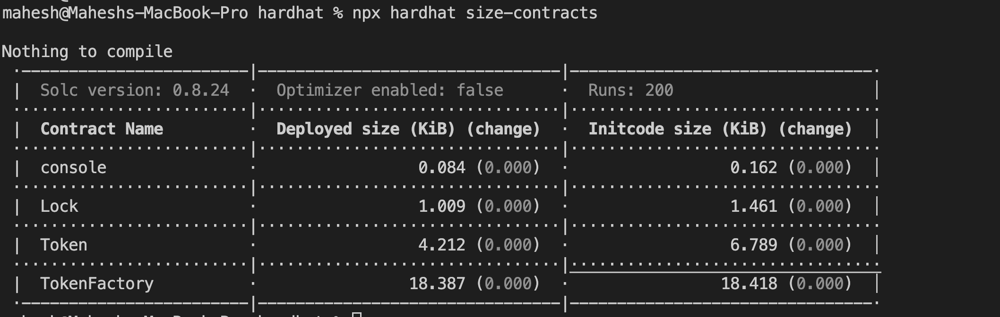
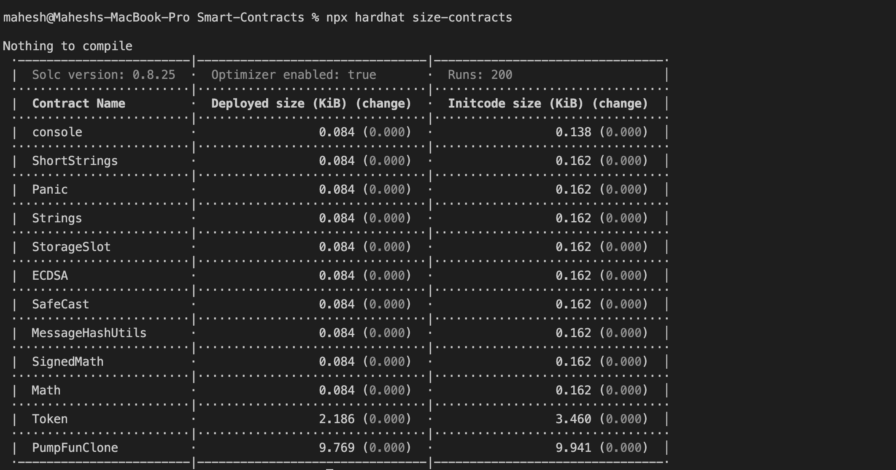

Pump.Fun - Decentralized Pump Events

Overview

Pump.Fun is a decentralized application (dApp) built on the Ethereum blockchain that allows users to create and buy  specific tokens. Users can pool funds to collectively "pump" the price of a token within a specified timeframe and share profits based on their contributions. The token creation in this application uses a bonding curve model.

This README outlines the project structure, setup instructions, and usage guidelines for developers and users.
Project Structure

The project is organized into three main directories:

smart-contracts: Contains the Solidity smart contracts deployed on the Ethereum blockchain.

frontend: Houses the React-based frontend for the dApp.

backend: Contains the Node.js backend for handling API interactions and off-chain logic.

project-root/
├── smart-contracts/
├── frontend/
├── backend/
├── README.md

Requirements

Ensure you have the following installed before proceeding:

Node.js (v16 or higher)

npm or yarn

Hardhat (for smart contract development)

MetaMask (browser extension for interacting with the dApp)

Contract deployed To Holesky Testnet :

Contract initial size :

Contract Optimized size :

